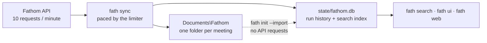

<p align="center">
  
</p>

<h1 align="center">fathom-helper</h1>

<p align="center">
  <em>Pulls every Fathom meeting onto disk, one folder each — transcript,
  summary, action items and the raw payload — in a layout you can hand to an
  agent without quoting a single path.</em>
</p>

<p align="center">
  <a href="#install">Install</a> &middot;
  <a href="#quickstart">Quickstart</a> &middot;
  <a href="docs/decisions.md">Decisions</a> &middot;
  <a href="docs/naming.md">Naming</a> &middot;
  <a href="CHANGELOG.md">Changelog</a>
</p>

<p align="center">
  
</p>



---

## What it is

Fathom records and transcribes your calls, but the transcripts live behind its
web app. Getting a few hundred of them somewhere an agent or a grep can read
means paging an API that allows ten requests a minute, and naming the results
so they still make sense once copied somewhere else.

fathom-helper does that sync and keeps doing it. Each meeting becomes a folder
with a predictable name:

```text
2024-04-19_weekly-demo-review_blaire-jules/
  2024-04-19_weekly-demo-review_blaire-jules_transcript.md
  2024-04-19_weekly-demo-review_blaire-jules_summary.md
  2024-04-19_weekly-demo-review_blaire-jules_action-items.md
  2024-04-19_weekly-demo-review_blaire-jules_meeting.json
```

Every name matches `[a-z0-9_-]` and nothing else: no spaces, no case, no
punctuation. `_` separates the three parts and `-` separates words inside a part,
so `split("_")` gives you back the date, the title and the attendees.

- **Syncs** new meetings into folders, pacing itself to Fathom's rate limit so a
  sync gets slower rather than failing.
- **Searches** every transcript full-text with `fath search <words>`.
- **Rebuilds** its database from the folders on disk, with no API requests.
- **Schedules** itself as a Windows Scheduled Task that needs no elevation and
  stores no password.
- **Shows** progress and settings in a terminal dashboard (`fath ui`) and a
  browser dashboard (`fath web`).
- **Diagnoses** itself with `fath doctor`, with the fix for each problem.

> [!NOTE]
> A personal tool, Windows-first. `fath schedule` exists on Windows only, and
> the `fath` command is a PowerShell shim; elsewhere, `python fath/main.py
> <command>` runs the rest. It writes outside its own directory in three
> places: the settings root (`%LOCALAPPDATA%\fathom-helper` by default), the
> output root (`Documents\Fathom` by default), and the API key line in the
> repo's `.env`. Video download is off by default and expensive — see
> [The rate limit](#the-rate-limit).

## Contents

<!-- toc -->

- [What it is](#what-it-is)
- [Requirements](#requirements)
- [Install](#install)
- [Quickstart](#quickstart)
- [Configuration](#configuration)
- [The rate limit](#the-rate-limit)
- [Features](#features)
- [Architecture in 30 seconds](#architecture-in-30-seconds)
- [Development](#development)
- [Layout](#layout)
- [License](#license)

<!-- /toc -->

## Requirements

| Piece | You need first | Without it |
|---|---|---|
| **Core** (`sync`, `search`, `web`, everything else) | Python 3.10+ and a [Fathom API key](https://fathom.video/customize#api-access-header) | nothing works |
| **`fath ui`** | `textual>=0.80` (`requirements.txt`) | `fath ui` says so plainly, rather than failing on an import |
| **`fath schedule`** | Windows Task Scheduler | sync by hand |
| **Changing the web UI** | Node and npm | nothing — the bundle is committed, so `fath web` needs no node |

The core is stdlib-only, so a scheduled sync depends on nothing.

## Install

Runs from the clone; nothing is installed or published.

<details open>
<summary><b>Windows</b> (PowerShell)</summary>

From the clone, with no setup at all:

```powershell
.\fath                                        # opens the dashboard
```

`fath.cmd` sits next to this README. With no arguments it runs `fath web`; with
arguments it is `fath` itself (`.\fath doctor`, `.\fath sync`).

To type a bare `fath` from anywhere, with tab completion:

```powershell
.\scripts\install-shim.ps1                    # into your own $PROFILE
. $PROFILE                                    # or open a new session
pip install -r requirements.txt               # optional: only for fath ui
```

</details>

<details>
<summary><b>Without the shim</b> (any platform)</summary>

```sh
python fath/main.py <command>
```

does the same thing as `fath <command>`.

</details>

Then verify:

```powershell
fath doctor
```

It diagnoses problems and names the fix for each.

### Unattended setup

```powershell
fath init --yes --output-root "D:\Meetings"    # take the defaults, ask nothing
```

`fath init` options: `--home <path>` keeps settings and the database elsewhere,
`--output-root <path>` sets where folders go, `--import <path>` adopts existing
folders, `--force` re-runs against an existing root. Re-pointing to a new
settings root does not move what is already there; it prints both paths and the
copy command, then stops.

The API key is read from the environment first (`FATHOM_PERSONAL_API_KEY`), then
the repo `.env`. `fath key --set` writes to `.env` by splicing the one line, so
other keys and comments survive.

## Quickstart

```powershell
fath init          # settings root, output folder, API key
fath sync          # fetch
fath web           # the dashboard
```

| | |
|---|---|
| `fath sync` | fetch new meetings into folders |
| `fath status` | what has been synced, and when |
| `fath search <words>` | full-text search across every transcript |
| `fath web` | the browser dashboard |
| `fath ui` | the terminal dashboard |
| `fath config` | view and change settings |
| `fath key` | set, clear or test the API key |
| `fath init` | first-run setup |
| `fath schedule` | install or remove the Scheduled Task |
| `fath doctor` | diagnose problems, with the fix for each |

Global: `--home <path>` to use a different settings root, `--debug` to log every
rate-limit header.

## Configuration

```powershell
fath config                          # every setting, its value, and which layer set it
fath config files.media              # one setting
fath config files.summary false      # change it
fath config --unset files.summary    # back to the default
```

Settings are declared once and rendered by `fath config`, `fath ui` and the
web dashboard's settings screen alike, with the same help text and validation.
`--advanced` shows the settings normally hidden behind a disclosure.

```text
<settings root>/          %LOCALAPPDATA%\fathom-helper by default
  config.json             settings
  local.json              machine-local overrides, applied on top
  token                   the web dashboard's shared secret
  state/fathom.db         what has been fetched, and the search index
  logs/fath.log           what the scheduled runs did

<output root>/            Documents\Fathom by default
  <one folder per meeting>

.env                      the API key, gitignored
```

The settings root is chosen at `fath init`. A non-default choice is recorded in a
one-line pointer file at the fixed location, **not** an environment variable: a
Scheduled Task inherits only the logon environment, so a `FATH_HOME` set in a
shell would never reach it and the scheduled run would quietly sync somewhere
else.

## The rate limit

Fathom allows **10 API requests per minute**. That number is measured from the
response headers, not documented — Fathom publishes no figure anywhere.

One request returns about ten meetings *with their transcripts*, so a full
history costs roughly one request per ten meetings. A few hundred meetings is
tens of requests and a few minutes. A routine run is one or two requests.

The tool reads the limit from every response and paces itself to stay under it,
so a sync gets slower rather than failing. Video is the expensive case: two
requests per meeting, which is what turns a full media download into hours.

## Features

<details open>
<summary><b>Adopting meetings you already have</b></summary>

```powershell
fath init --import "C:\path\to\existing\folders"
```

Reads each folder's `meeting.json` to rebuild the database. **No API requests.**
This is also what makes a lost database cheap: the folders on disk are the
record, and a rebuild is a directory scan rather than a re-download.

</details>

<details>
<summary><b>The dashboard</b></summary>

`fath web` serves a React app on `127.0.0.1:8899` and opens it. No node needed —
the bundle is committed. It binds loopback only, sends no CORS headers, checks
the `Host` header, and requires a token on every write.

Five screens:

- **Overview** — the key and the last run.
- **Sync** — per-artifact choices, live cost estimates and a rate meter.
- **Meetings** — a browser that renders the markdown off disk.
- **Search** — transcript search.
- **Settings** — with a live folder-name preview, so you can judge a naming
  change before saving it.

</details>

<details>
<summary><b>Scheduling</b></summary>

```powershell
fath schedule --install --every 4      # every four hours
fath schedule --status
fath schedule --remove
```

Runs `fath sync --quiet` with no console window, catches up after the machine has
been asleep, never runs two syncs at once, needs no elevation and stores no
password. Failures land in `logs/fath.log` and in Task Scheduler's last-result
column.

</details>

## Architecture in 30 seconds

`fath/main.py` is the entry point; `fath/cli.py` dispatches each subcommand from
`fath/commands.conf`, one module per command in `fath/commands/`.

Sync, naming, the API client, the limiter and the web server are stdlib only.
One sync engine emits one event stream, and the CLI, the terminal UI and the web
UI all consume it rather than re-deriving progress.

[docs/naming.md](docs/naming.md) records the seven folder-name defects the
rules encode. [docs/decisions.md](docs/decisions.md) is the "why" register.

## Development

```powershell
.\scripts\check.ps1          # ruff, mypy, pytest, tsc, bundle freshness
.\scripts\check.ps1 -Quick   # skip the slow end-to-end suite
```

To change the UI:

```powershell
cd web
npm install
npm run dev      # vite on 5173, proxying the API to 8899
npm run build    # rebuild the committed bundle
```

Process rules for contributors and agents are in [AGENTS.md](AGENTS.md).

## Layout

```text
fathom-helper/
├── fath/       the CLI, sync engine, API client, limiter and web server
├── web/        React dashboard source; dist/ is the committed bundle
├── scripts/    shim installer, Scheduled Task installer, check.ps1
├── tests/      pytest suite
└── docs/       decisions.md, naming.md
```

## License

[MIT](LICENSE).

See [Security and privacy](SECURITY.md) before sharing exports, diagnostics, or a checkout.

People, companies, meeting titles, dates, and recording IDs in examples and tests
are fictional. Regression fixtures preserve technical edge cases, not private meetings.
# fathom-clerk
